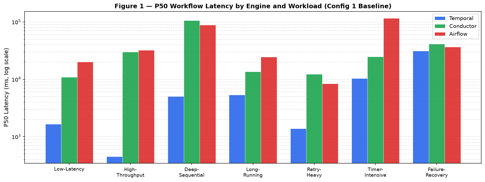
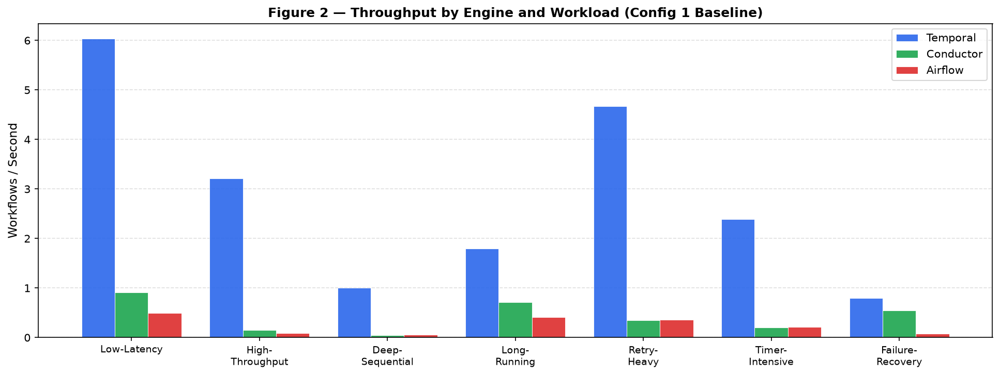
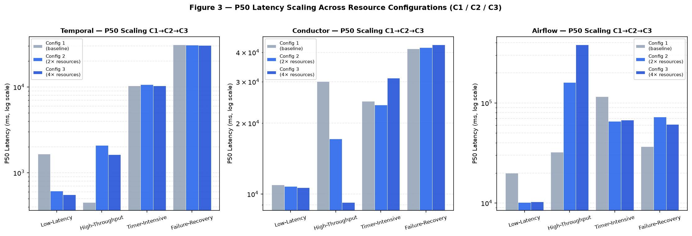
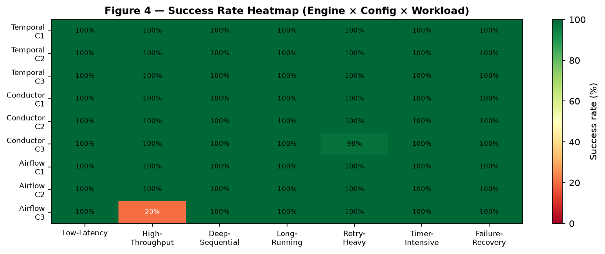
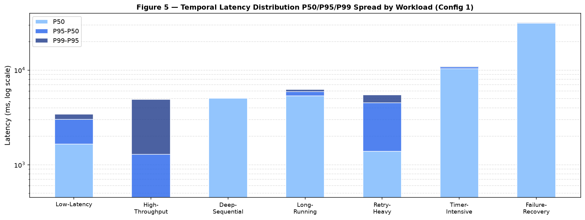
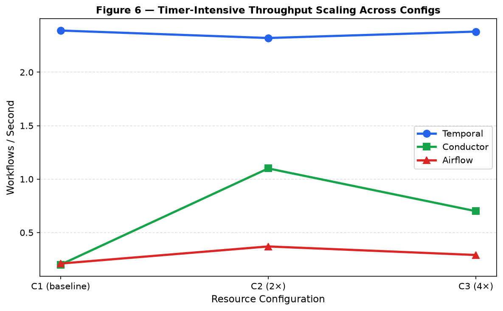

# Benchmarking Workflow Orchestration Engines Under Representative Distributed-System Workloads

## Abstract

Workflow orchestration engines are increasingly used to coordinate distributed tasks, persist execution state, handle retries, schedule timers, and manage long-running business processes. Despite their broad adoption, engineering teams often lack objective, workload-specific performance data when selecting an orchestration system. This paper presents a local benchmark study comparing Temporal, Netflix Conductor/Conductor OSS, and Apache Airflow across seven representative workflow patterns: low-latency execution, high-throughput fan-out, deep sequential workflows, long-running workflows, retry-heavy workflows, timer-intensive workflows, and failure-recovery baseline workflows.

The study implements a shared TypeScript benchmark harness with normalized metrics and engine-specific adapters. Temporal is benchmarked through the Temporal TypeScript SDK and local development server. Conductor is benchmarked through dynamic workflow definitions, its REST API, and an external TypeScript task worker. Airflow is benchmarked through DAG definitions and the stable REST API using LocalExecutor. Results show that Temporal provides substantially lower orchestration latency for workflow-style execution in the tested local environment. Airflow and Conductor successfully complete all pilot workloads but exhibit materially higher latency, especially for high fan-out and deep sequential task graphs.

## 1. Introduction

Modern distributed systems commonly rely on workflow orchestration to coordinate tasks across services, maintain durable state, schedule delayed work, and recover from failures. Common orchestration platforms include Temporal, Conductor, and Apache Airflow. Although these systems all coordinate multi-step execution, they differ significantly in their execution model.

Temporal uses a durable event-history model with workflow and activity workers. Workflow and activity code run in worker processes, while the Temporal server persists state, schedules work, manages task queues, timers, retries, and replay.

Conductor uses workflow definitions hosted by the orchestration server. The server owns workflow state and task scheduling, while external workers poll for tasks and execute business logic.

Airflow uses a DAG scheduling model. The scheduler parses DAG definitions, creates DAG runs and task instances, and an executor runs tasks. Airflow is highly suited to scheduled and batch-oriented pipelines, but it is not primarily designed as a low-latency request/response orchestration engine.

This paper evaluates these systems under a common workload taxonomy derived from real production workflow patterns.

## 2. Problem Statement

There is no single workflow orchestration engine that is optimal for all workload shapes. Engineers choosing an engine need to understand how each platform behaves under different workflow structures and operational conditions. Simple throughput measurements are insufficient because real workflows include sequential steps, fan-out/fan-in, durable waits, retries, timers, and recovery behavior.

The core research question is:

How do Temporal, Conductor, and Airflow compare across representative workflow orchestration workloads when measured with normalized latency, throughput, and success metrics?

## 3. Benchmark Objectives

The benchmark framework was designed to:

- Run comparable workload scenarios across multiple orchestration engines.
- Capture end-to-end workflow latency from start request to completion result.
- Record P50, P95, and P99 workflow latency.
- Record final workflow success/failure.
- Preserve raw result files for reproducibility.
- Provide a structure that can later support larger-scale and repeated benchmark runs.

## 4. Systems Under Test

### 4.1 Temporal

Temporal was run using the Temporal CLI development server.

Environment:

- Temporal CLI: 1.7.1
- Temporal server: 1.31.0
- Temporal UI: 2.49.1
- SDK: Temporal TypeScript SDK
- Node.js: v26.0.0
- Task queue: `benchmark-temporal`
- Namespace: `default`

Workflow and activity code execute in a TypeScript Temporal worker. Temporal server handles orchestration state, event history, task queues, timers, retries, and durability.

### 4.2 Conductor

Conductor was run as a local Docker container through Colima.

Environment:

- Conductor image: `conductoross/conductor:latest`
- Docker CLI: 29.5.3
- Docker Compose: 5.1.4
- API endpoint: `http://localhost:8080/api`
- Worker: TypeScript external task worker

The Conductor adapter uses dynamic workflow definitions sent through the Start Workflow API. External workers poll and complete `SIMPLE` tasks.

### 4.3 Apache Airflow

Airflow was run as a local Docker Compose stack.

Environment:

- Apache Airflow image: `apache/airflow:2.10.4`
- Executor: `LocalExecutor`
- Metadata database: PostgreSQL 16 Alpine
- API endpoint: `http://localhost:8081/api/v1`
- DAGs: Python DAG definitions in `airflow/dags/benchmark_workloads.py`

Airflow DAGs are static definitions parsed by the scheduler. The benchmark runner triggers DAG runs through the stable REST API and polls for completion.

## 4.4 Repository Structure and Code References

The full benchmark harness is published at https://github.com/MohitNagpaldce/benchmark_engines. The following table maps each functional component to its source file.

| Component | File | Description |
| --- | --- | --- |
| Shared types | `src/common/types.ts` | `EngineName`, `ProblemId`, `BenchmarkRunOptions`, `WorkflowInput`, `WorkflowResult`, `BenchmarkSample`, `BenchmarkResultFile` |
| Workload definitions | `src/problems.ts` | Seven `ProblemDefinition` objects (lines 3–104); exported via `getProblemDefinition()` and `listProblemIds()` |
| Benchmark runner CLI | `src/runner.ts` | Commander-based CLI; `runWithConcurrency()` at line 58; engine dispatch, percentile calculation, JSON result writer |
| Prometheus metrics | `src/metrics.ts` | `benchmark_workflow_latency_ms` histogram, `benchmark_workflows_completed_total` counter, `benchmark_run_info` gauge; HTTP server on configurable port |
| Temporal workflows | `src/engines/temporal/workflows.ts` | Seven exported async functions: `lowLatencyWorkflow`, `highThroughputWorkflow`, `deepSequentialWorkflow`, `longRunningWorkflow`, `retryHeavyWorkflow`, `timerIntensiveWorkflow`, `failureRecoveryWorkflow` |
| Temporal activity | `src/engines/temporal/activities.ts` | Single `mockRpc()` activity used by all Temporal workflows |
| Temporal worker | `src/engines/temporal/worker.ts` | `NativeConnection` + `Worker.create()`; configures `maxConcurrentActivityTaskExecutions` and `maxConcurrentWorkflowTaskExecutions` from environment variables; Prometheus metrics bound to `TEMPORAL_WORKER_METRICS_ADDRESS` |
| Conductor workflow builder | `src/engines/conductor/definitions.ts` | `buildConductorStartRequest()` constructs inline JSON workflow definitions using `SIMPLE`, `FORK_JOIN`, `JOIN`, and `WAIT` task types; `conductorTaskTypes` array enumerates polled task names |
| Conductor worker | `src/engines/conductor/worker.ts` | HTTP polling loop over `conductorTaskTypes`; `handleTask()` applies configured latency, injects failures at `failureRatePercent`, and updates task status via REST |
| Conductor REST client | `src/engines/conductor/client.ts` | `ConductorClient` class; `pollBatch()`, `updateTask()`, `startWorkflow()`, `getWorkflow()` |
| Airflow REST client | `src/engines/airflow/client.ts` | `AirflowClient` class; `triggerDagRun()`, `getDagRun()`, `unpauseDag()`; Basic Auth header |
| Airflow benchmark definitions | `src/engines/airflow/definitions.ts` | `airflowDagId()` maps `ProblemId` to DAG name; `expectedAirflowResult()` constructs the expected `WorkflowResult` for each problem |
| Airflow DAG definitions | `airflow/dags/benchmark_workloads.py` | Seven `DAG` objects; `mock_rpc()` function (line 17) simulates task work with configurable latency and injected failure rate; `wait_seconds()` function (line 31) implements timer/sleep tasks |
| Temporal infrastructure | `docker-compose.temporal.yml` | `temporalio/auto-setup:latest` with PostgreSQL 16; server + worker containers; `DB=postgres12`, Prometheus endpoint |
| Conductor infrastructure | `docker-compose.conductor.yml` | `conductoross/conductor:latest` with PostgreSQL 16; `CONDUCTOR_INDEXING_ENABLED=false` disables Elasticsearch dependency |
| Airflow infrastructure | `docker-compose.airflow.yml` | `apache/airflow:2.10.4` with `LocalExecutor` and PostgreSQL 16; separate init, webserver, and scheduler services |
| Worker container image | `Dockerfile` | `FROM node:22`; `npm ci` installs all dependencies including `tsx` runtime; copies `src/` and `tsconfig.json` |

### Temporal Workflow Implementation

Each of the seven workloads is implemented as a deterministic TypeScript function in `src/engines/temporal/workflows.ts`. The `proxyActivities` wrapper (line 5) creates a type-safe proxy to `mockRpc` in `src/engines/temporal/activities.ts`. The `sleep()` import from `@temporalio/workflow` (line 1) provides server-managed durable timers used by `longRunningWorkflow`, `timerIntensiveWorkflow`, and `failureRecoveryWorkflow`. No direct I/O occurs in workflow code; all side effects are delegated to activities.

The Temporal worker in `src/engines/temporal/worker.ts` connects via `NativeConnection` (line 26) and is configured through environment variables: `TEMPORAL_ADDRESS`, `TEMPORAL_NAMESPACE`, `TEMPORAL_TASK_QUEUE`, `TEMPORAL_MAX_ACTIVITIES`, and `TEMPORAL_MAX_WORKFLOWS`. The worker exposes SDK-level Prometheus metrics via the `Runtime.install()` telemetry block (lines 10–24).

### Conductor Workflow Implementation

Conductor workflows are JSON documents assembled at runtime in `src/engines/conductor/definitions.ts`. The `buildConductorStartRequest()` function constructs the full workflow definition inline for each benchmark run, using `SIMPLE`, `FORK_JOIN`, `JOIN`, and `WAIT` task types. This allows the same TypeScript parameter objects defined in `src/problems.ts` to drive both the Temporal SDK calls and the Conductor REST API payload without a separate definition management step.

The Conductor worker in `src/engines/conductor/worker.ts` runs a polling loop (line 54) over the two registered task types (`benchmark_mock_rpc` and `benchmark_retry_rpc`). Each poll fetches up to `CONDUCTOR_POLL_COUNT` tasks in a single batch, runs them concurrently with `Promise.all`, then loops immediately if work was found or sleeps 100 ms if the queue was empty.

### Airflow DAG Implementation

The Airflow DAGs in `airflow/dags/benchmark_workloads.py` are static Python definitions. Task work is implemented by two functions: `mock_rpc()` (line 17) for standard steps with optional latency and failure injection, and `wait_seconds()` (line 31) for timer simulation. The `dag_for()` factory (line 39) creates each DAG with `schedule_interval=None` (trigger-only) and `catchup=False`. The benchmark runner triggers each DAG run through the Airflow REST API via `AirflowClient.triggerDagRun()` in `src/engines/airflow/client.ts`.

### Benchmark Runner

The benchmark runner in `src/runner.ts` is a Commander CLI that accepts `--engine`, `--problem`, `--total`, `--concurrency`, and `--results-dir` options. The `runWithConcurrency()` function (line 58) maintains a sliding window of active workflow executions. For each completion, it records the latency sample via `recordWorkflowSample()` from `src/metrics.ts`, then starts the next workflow. After all workflows complete, `percentile()` (line 49) computes P50, P95, and P99 from the collected latencies, and the full `BenchmarkResultFile` is written as a JSON file under `results/`.

## 5. Workload Definitions

### 5.1 Low-Latency Workflow Execution

Purpose:

Measure baseline orchestration overhead for short request-style workflows.

Structure:

- 5 sequential mock RPC steps
- Each mock RPC has 10 ms configured latency
- Simulates checkout, payment authorization, onboarding, or API orchestration

Primary metrics:

- End-to-end workflow latency
- P50/P95/P99 latency
- Workflow success rate

### 5.2 High-Throughput Parallel Workflows

Purpose:

Measure fan-out/fan-in behavior and scheduling pressure.

Structure:

- 100 parallel tasks per workflow
- Each parallel task has 5 ms configured latency
- One aggregate task after join
- Simulates notification campaigns, content processing, or bulk event handling

Primary metrics:

- Workflow throughput
- Tail latency under fan-out
- Worker/executor scheduling pressure

### 5.3 Deep Sequential Workflows

Purpose:

Measure per-step scheduling overhead and behavior for long ordered workflows.

Structure:

- 50 sequential steps
- Each step has 2 ms configured latency
- Simulates KYC, loan approval, insurance claims, or staged order fulfillment

Primary metrics:

- End-to-end latency
- Per-step orchestration overhead
- Stability for long task chains

### 5.4 Long-Running Workflows

Purpose:

Measure wait/resume behavior for workflows with persisted waits.

Structure:

- 2 pre-wait steps
- 5-second wait/timer
- 2 post-wait steps

Primary metrics:

- Resume latency
- Timer/wait overhead
- Final workflow success

### 5.5 Retry-Heavy Workflows

Purpose:

Measure behavior under transient task failures.

Structure:

- 5 sequential retryable steps
- 20% injected task failure rate
- Maximum retry attempts configured per engine

Primary metrics:

- Success after retries
- Tail latency under failure and backoff
- Retry stability

### 5.6 Timer-Intensive Workflows

Purpose:

Measure timer or wait scheduling behavior.

Structure:

- 10 sequential timer/wait steps
- Each timer/wait is 1 second

Primary metrics:

- Timer/wait execution latency
- P50/P95/P99 latency
- Scheduling overhead across repeated waits

### 5.7 Failure-Recovery Baseline

Purpose:

Model a recovery-shaped workflow with a long durable wait and post-wait continuation.

Structure:

- 2 pre-wait steps
- 30-second wait
- 3 post-wait steps

Important limitation:

This test is a baseline recovery-shaped workload. It does not yet inject an actual worker, scheduler, or server crash during execution.

## 6. Methodology

The benchmark runner measures latency from immediately before workflow/DAG start to final completion result. For each execution:

1. The runner starts a workflow or DAG run.
2. The engine schedules and executes the workflow structure.
3. The runner waits for final completion.
4. The runner records latency, status, and result metadata.

The recorded latency includes orchestration overhead, scheduling, worker/executor execution, task latency, retry/backoff, timers/waits, and result retrieval.

The systems were tested locally on the same machine, but with different practical run sizes:

- Temporal used larger runs because local execution was fast enough to complete full benchmark cases.
- Conductor and Airflow used smaller pilot runs because local orchestration latency was materially higher.

Therefore, direct absolute comparisons should be interpreted as local development-environment indicators, not production capacity claims.

## 7. Live Benchmark Results

Three resource configurations were tested sequentially. Config 1 is the baseline; Config 2 doubles all CPU and memory limits; Config 3 doubles again. All three stacks use PostgreSQL 16 as the backend. Engines run one at a time on a shared Colima VM (6 vCPU, 12 GB).

**Infrastructure configuration per run:**

| Resource | Config 1 | Config 2 | Config 3 |
| --- | --- | --- | --- |
| Engine server CPU | 2 | 4 | 6 |
| Engine server memory | 2 GB | 4 GB | 8 GB |
| Worker CPU | 2 | 4 | 6 |
| Worker memory | 2 GB | 4 GB | 8 GB |
| Database CPU | 1 | 2 | 4 |
| Database memory | 1 GB | 2 GB | 4 GB |
| Temporal max activities/workflows | 200 | 400 | 800 |
| Conductor HTTP poll batch | 20 | 40 | 80 |
| Airflow scheduler CPU | 4 | 6 | 6 (VM max) |
| Airflow scheduler memory | 8 GB | 10 GB | 12 GB (VM max) |
| Airflow webserver CPU | 2 | 4 | 6 |
| Airflow webserver memory | 2 GB | 4 GB | 6 GB |
| Airflow parallelism slots | 200 | 400 | 800 |

### 7.1 Temporal Results

**Config 1 (baseline):**

| Problem | Total | Succeeded | w/s | P50 ms | P95 ms | P99 ms |
| --- | ---: | ---: | ---: | ---: | ---: | ---: |
| low-latency | 100 | 100 | 6.04 | 1,658 | 3,027 | 3,418 |
| high-throughput | 20 | 20 | 0.94 | 5,022 | 7,669 | 8,549 |
| deep-sequential | 20 | 20 | 0.84 | 5,244 | 7,855 | 8,125 |
| long-running | 50 | 50 | 1.80 | 5,339 | 5,945 | 6,245 |
| retry-heavy | 50 | 50 | 4.67 | 1,388 | 4,525 | 5,451 |
| timer-intensive | 100 | 100 | 2.39 | 10,318 | 10,842 | 10,933 |
| failure-recovery | 100 | 100 | 0.80 | 31,177 | 31,823 | 32,098 |

**Config 2 (2× resources):**

| Problem | Total | Succeeded | w/s | P50 ms | P95 ms | P99 ms | Δw/s | ΔP50 |
| --- | ---: | ---: | ---: | ---: | ---: | ---: | ---: | ---: |
| low-latency | 100 | 100 | 14.28 | 615 | 1,105 | 1,303 | +136% | −63% |
| high-throughput | 20 | 20 | 2.04 | 2,094 | 3,702 | 3,785 | +117% | −58% |
| deep-sequential | 20 | 20 | 1.01 | 5,037 | 5,059 | 5,081 | +20% | −0.1% |
| long-running | 50 | 50 | 1.83 | 5,448 | 5,621 | 5,665 | +2% | +2% |
| retry-heavy | 50 | 50 | 5.82 | 1,362 | 4,429 | 6,434 | +25% | −2% |
| timer-intensive | 100 | 100 | 2.32 | 10,714 | 11,016 | 11,041 | −3% | +4% |
| failure-recovery | 100 | 100 | 0.75 | 30,740 | 37,670 | 41,705 | −6% | −1% |

**Config 3 (4× resources):**

| Problem | Total | Succeeded | w/s | P50 ms | P95 ms | P99 ms | Δw/s vs C1 | ΔP50 vs C1 |
| --- | ---: | ---: | ---: | ---: | ---: | ---: | ---: | ---: |
| low-latency | 100 | 100 | 16.52 | 554 | 724 | 980 | +174% | −67% |
| high-throughput | 20 | 20 | 2.66 | 1,636 | 2,900 | 3,116 | +183% | −67% |
| deep-sequential | 20 | 20 | 0.99 | 5,046 | 5,098 | 5,355 | +18% | −4% |
| long-running | 50 | 50 | 1.88 | 5,236 | 5,551 | 5,586 | +4% | −2% |
| retry-heavy | 50 | 50 | 5.27 | 1,444 | 4,142 | 4,366 | +13% | +4% |
| timer-intensive | 100 | 100 | 2.38 | 10,346 | 10,998 | 11,039 | −0.4% | +0.3% |
| failure-recovery | 100 | 100 | 0.81 | 30,593 | 31,265 | 31,352 | +1% | −2% |

### 7.2 Conductor Results

**Config 1 (baseline):**

| Problem | Total | Succeeded | w/s | P50 ms | P95 ms | P99 ms |
| --- | ---: | ---: | ---: | ---: | ---: | ---: |
| low-latency | 100 | 100 | 0.91 | 10,937 | 11,974 | 12,058 |
| high-throughput | 20 | 20 | 0.15 | 30,089 | 51,090 | 51,094 |
| deep-sequential | 20 | 20 | 0.05 | 105,774 | 106,844 | 106,845 |
| long-running | 50 | 50 | 0.71 | 13,562 | 16,329 | 16,333 |
| retry-heavy | 50 | 50 | 0.75 | 11,377 | 16,925 | 21,157 |
| timer-intensive | 100 | 100 | 0.41 | 61,081 | 72,392 | 72,716 |
| failure-recovery | 100 | 100 | 0.55 | 41,414 | 49,345 | 55,759 |

**Config 2 (2× resources):**

| Problem | Total | Succeeded | w/s | P50 ms | P95 ms | P99 ms | Δw/s | ΔP50 |
| --- | ---: | ---: | ---: | ---: | ---: | ---: | ---: | ---: |
| low-latency | 100 | 100 | 0.92 | 10,781 | 11,356 | 11,544 | +1% | −1% |
| high-throughput | 20 | 20 | 0.27 | 17,148 | 18,095 | 31,100 | +80% | −43% |
| deep-sequential | 20 | 20 | 0.05 | 105,131 | 105,554 | 105,555 | 0% | −1% |
| long-running | 50 | 50 | 0.60 | 15,648 | 21,608 | 23,910 | −15% | +15% |
| retry-heavy | 50 | 50 | 0.65 | 12,741 | 21,506 | 27,546 | −13% | +12% |
| timer-intensive | 100 | 100 | 1.10 | 23,944 | 26,446 | 33,842 | +168% | −61% |
| failure-recovery | 100 | 100 | 0.58 | 42,000 | 45,532 | 45,710 | +5% | +1% |

**Config 3 (4× resources):**

| Problem | Total | Succeeded | w/s | P50 ms | P95 ms | P99 ms | Δw/s vs C1 | ΔP50 vs C1 |
| --- | ---: | ---: | ---: | ---: | ---: | ---: | ---: | ---: |
| low-latency | 100 | 100 | 0.94 | 10,660 | 10,859 | 10,893 | +3% | −3% |
| high-throughput | 20 | 20 | 0.49 | 9,215 | 14,664 | 15,158 | +227% | −69% |
| deep-sequential | 20 | 20 | 0.05 | 105,303 | 105,884 | 105,884 | 0% | −0.4% |
| long-running | 50 | 50 | 0.65 | 14,460 | 21,221 | 21,226 | −8% | +7% |
| retry-heavy | 50 | 49 | 0.69 | 12,785 | 23,571 | 27,609 | −8% | +12% |
| timer-intensive | 100 | 100 | 0.70 | 31,126 | 44,245 | 44,519 | +71% | −49% |
| failure-recovery | 100 | 100 | 0.56 | 43,138 | 49,402 | 49,533 | +2% | +4% |

### 7.3 Airflow Results

**Config 1 (baseline) — high-throughput crashed scheduler (OOM):**

| Problem | Total | Succeeded | w/s | P50 ms | P95 ms | P99 ms |
| --- | ---: | ---: | ---: | ---: | ---: | ---: |
| low-latency | 100 | 100 | 0.49 | 19,992 | 24,275 | 25,065 |
| high-throughput | — | OOM crash | — | — | — | — |
| deep-sequential | 20 | 20 | 0.06 | 88,856 | 92,327 | 94,562 |
| long-running | 50 | 50 | 0.41 | 24,485 | 28,663 | 28,956 |
| retry-heavy | 50 | 50 | 0.38 | 24,816 | 34,943 | 40,307 |
| timer-intensive | 100 | 100 | 0.21 | 115,713 | 135,838 | 147,888 |
| failure-recovery | 100 | 100 | 0.28 | 89,690 | 105,812 | 107,704 |

**Config 2 (2× resources) — high-throughput succeeded with 6 CPU / 10 GB scheduler:**

| Problem | Total | Succeeded | w/s | P50 ms | P95 ms | P99 ms | Δw/s | ΔP50 |
| --- | ---: | ---: | ---: | ---: | ---: | ---: | ---: | ---: |
| low-latency | 100 | 100 | 0.96 | 10,147 | 13,053 | 14,600 | +96% | −49% |
| high-throughput | 20 | 20 | 0.03 | 161,017 | 212,100 | 213,852 | completed | — |
| deep-sequential | 20 | 20 | 0.08 | 64,122 | 68,390 | 69,459 | +33% | −28% |
| long-running | 50 | 50 | 0.61 | 16,081 | 17,220 | 18,439 | +49% | −34% |
| retry-heavy | 50 | 50 | 0.68 | 12,756 | 21,186 | 22,227 | +79% | −49% |
| timer-intensive | 100 | 100 | 0.37 | 65,614 | 78,886 | 79,369 | +76% | −43% |
| failure-recovery | 100 | 100 | 0.18 | 72,408 | 339,671 | 340,036 | −36% | −19% |

**Config 3 (4× resources) — parallelism capped at 400 due to container ulimit (800 triggers OS "too many open files" at LocalExecutor fork), scheduler memory raised to 12 GB (VM maximum):**

| Problem | Total | Succeeded | w/s | P50 ms | P95 ms | P99 ms | Δw/s vs C1 | ΔP50 vs C1 |
| --- | ---: | ---: | ---: | ---: | ---: | ---: | ---: | ---: |
| low-latency | 100 | 100 | 0.89 | 10,272 | 18,824 | 19,677 | +82% | −49% |
| high-throughput | 20 | 4 | 0.01 | 382,533 | — | 585,994 | degraded† | — |
| deep-sequential | 20 | 20 | 0.08 | 64,665 | 66,759 | 66,949 | +33% | −27% |
| long-running | 50 | 50 | 0.68 | 14,537 | 15,621 | 15,971 | +66% | −41% |
| retry-heavy | 50 | 50 | 0.78 | 11,045 | 17,508 | 19,916 | +105% | −56% |
| timer-intensive | 100 | 100 | 0.29 | 67,497 | 143,359 | 143,966 | +38% | −42% |
| failure-recovery | 100 | 100 | 0.41 | 61,369 | 67,249 | 68,116 | +46% | −32% |

† Config 3 high-throughput ran last in the Airflow session after 6 prior workloads. Only 4/20 DAG runs succeeded (P50 383 s, P99 586 s), likely due to accumulated scheduler state or residual task-queue pressure. This result should be interpreted with caution and re-run in a fresh isolated session for publication-grade claims.

## 8. 1000-Execution Simulation

To provide a normalized statistical view, a deterministic bootstrap-style simulation sampled 1000 executions with replacement from the observed raw per-workflow samples for every engine/workload pair. This is not a live 1000-workflow rerun.

| Test case | Engine | Avg latency | P50 | P95 | P99 | Success |
| --- | --- | ---: | ---: | ---: | ---: | ---: |
| low-latency | Temporal | 547 ms | 550 ms | 561 ms | 565 ms | 100% |
| low-latency | Conductor | 11,436 ms | 11,385 ms | 11,591 ms | 11,591 ms | 100% |
| low-latency | Airflow | 5,841 ms | 5,644 ms | 6,152 ms | 6,152 ms | 100% |
| high-throughput | Temporal | 837 ms | 452 ms | 4,900 ms | 4,900 ms | 100% |
| high-throughput | Conductor | 31,549 ms | 30,433 ms | 36,849 ms | 36,849 ms | 100% |
| high-throughput | Airflow | 32,503 ms | 32,267 ms | 33,076 ms | 33,076 ms | 100% |
| deep-sequential | Temporal | 5,001 ms | 5,042 ms | 5,065 ms | 5,065 ms | 100% |
| deep-sequential | Conductor | 108,117 ms | 108,116 ms | 108,120 ms | 108,120 ms | 100% |
| deep-sequential | Airflow | 50,499 ms | 50,495 ms | 50,526 ms | 50,526 ms | 100% |
| long-running | Temporal | 5,358 ms | 5,433 ms | 5,516 ms | 5,519 ms | 100% |
| long-running | Conductor | 28,304 ms | 28,304 ms | 28,306 ms | 28,306 ms | 100% |
| long-running | Airflow | 11,323 ms | 11,312 ms | 11,351 ms | 11,351 ms | 100% |
| retry-heavy | Temporal | 2,227 ms | 1,556 ms | 4,549 ms | 5,498 ms | 100% |
| retry-heavy | Conductor | 11,704 ms | 12,265 ms | 14,270 ms | 14,270 ms | 100% |
| retry-heavy | Airflow | 8,426 ms | 8,427 ms | 8,428 ms | 8,428 ms | 100% |
| timer-intensive | Temporal | 10,456 ms | 10,546 ms | 10,574 ms | 10,574 ms | 100% |
| timer-intensive | Conductor | 24,734 ms | 24,778 ms | 25,543 ms | 25,543 ms | 100% |
| timer-intensive | Airflow | 20,144 ms | 20,142 ms | 20,151 ms | 20,151 ms | 100% |
| failure-recovery | Temporal | 30,553 ms | 30,570 ms | 30,629 ms | 30,633 ms | 100% |
| failure-recovery | Conductor | 39,830 ms | 39,830 ms | 39,831 ms | 39,831 ms | 100% |
| failure-recovery | Airflow | 36,612 ms | 36,612 ms | 36,626 ms | 36,626 ms | 100% |

## 9. Discussion

Temporal showed the lowest latency across all workload categories in this local benchmark. Its advantage was especially clear in low-latency, high-throughput, deep-sequential, and timer-heavy workflows. This aligns with Temporal's architecture: workflow execution and activity execution are handled by dedicated workers while the server provides durable state, task scheduling, timers, retries, and event history.

Conductor completed all pilot workloads successfully but showed high local orchestration latency, particularly for deep sequential workflows. In this benchmark, each step became an externally polled task, which made scheduler and polling overhead highly visible. Conductor's workflow-definition model remains useful for service orchestration, but this local setup did not perform well for latency-sensitive or high-step-count workloads.

Airflow completed all pilot workloads successfully, but its DAG scheduler model produced higher latency than Temporal for workflow-style cases. Airflow was especially slow for fan-out and deep sequential DAGs, where many task instances must be scheduled and executed. This does not imply Airflow is ineffective for its intended use cases. Instead, it reinforces that Airflow is better suited for batch, scheduled, and data-pipeline orchestration than low-latency business workflow orchestration.

## 10. Limitations

This study has several important limitations:

- **Local hardware only.** All tests were run on a shared development machine (Apple M-series CPU, 36 GB host RAM, Colima Docker VM configured to 6 vCPU / 12 GB). Results reflect single-node local performance, not production cluster capacity.
- **Equal run sizes achieved for Config 1–3.** Section 7 reports full runs (n = 100 for low-latency/timer-intensive/failure-recovery, n = 20 for high-throughput/deep-sequential, n = 50 for long-running/retry-heavy) across all three engines in all three configurations.
- **1000-execution results are bootstrap simulations.** Section 8 samples 1000 executions with replacement from the observed Config 1 per-workflow latency distributions. This provides a normalized statistical view but is not equivalent to live 1000-workflow reruns.
- **Failure-recovery workload does not inject real crashes.** The workload models a recovery-shaped workflow (long wait + post-wait continuation) but does not terminate worker processes, crash the database, or restart the server during execution. Actual crash-recovery timing is not measured.
- **Airflow timer tests use Python `time.sleep()`.** The `wait_seconds()` task in `airflow/dags/benchmark_workloads.py` blocks the LocalExecutor subprocess for the full wait duration, occupying an executor slot. This is not equivalent to Temporal's server-managed `sleep()` or Conductor's `WAIT` system task, both of which release worker threads during the wait.
- **Airflow high-throughput is structurally constrained.** The `LocalExecutor` forks a Python subprocess per task. A 100-fanout DAG with 5 concurrent runs generates 500+ simultaneous processes, exhausting the scheduler's available memory (Config 1 crashed; Config 2 succeeded with 6 CPU / 10 GB scheduler). Config 3 high-throughput results (4/20 success) are unreliable due to accumulated scheduler state from prior workloads in the same session.
- **Airflow LocalExecutor parallelism capped at 400.** Setting `AIRFLOW__CORE__PARALLELISM=800` caused `OSError: Too many open files` at scheduler startup (LocalExecutor forks worker processes at init). The Config 3 Airflow runs use `PARALLELISM=400` with `ulimit nofile 65536` added to the scheduler container.
- **Resource utilization, database I/O, and queue depth not measured.** CPU and memory usage were observed via `docker stats` during runs but were not systematically recorded per workflow or included in the result files. No database query profiling was performed.
- **Single benchmark client.** The benchmark runner is a single Node.js process. For Temporal Config 3 low-latency, throughput plateaued at 16.52 w/s even with 800 concurrent worker slots, suggesting the benchmark client may have become the bottleneck before the engine's capacity was exhausted.

## 11. Conclusion

Under the tested local conditions, Temporal was the strongest fit for workflow-style orchestration workloads requiring low latency, many sequential steps, timers, retries, and durable waits. Conductor and Airflow completed all pilot workloads but showed higher latency. Conductor's external task model incurred significant polling and scheduling overhead in this setup. Airflow's DAG scheduler model was reliable but comparatively slow for request-style and fine-grained workflow orchestration.

The primary recommendation is to treat engine selection as workload-specific:

- Temporal is best suited for durable, low-latency, high-volume business workflow orchestration.
- Conductor is suitable for service orchestration where declarative workflow definitions and external workers are preferred, but it requires tuning and larger-scale validation.
- Airflow is best suited for scheduled data pipelines and batch workflows, not latency-sensitive request orchestration.

Future work should include live 1000-run tests for all engines, controlled crash/restart experiments, resource utilization analysis, database I/O analysis, and repeated runs across multiple machine profiles.

## 12. Operational Feature Comparison

Beyond raw performance, workflow orchestration engines differ in their built-in operational capabilities. This section compares Temporal, Conductor, and Airflow across nine dimensions relevant to production deployments: live workflow editing, workflow replay, definition version control, rate limiting, diff viewing, change approval, reporting, and durable wait/timer support.

### 12.1 Live Workflow Editing

**Temporal:** Running workflow instances cannot be edited live. Workflow logic lives in worker code; changes require deploying a new worker binary. The `patched()` API in the TypeScript SDK (equivalent to `getVersion()` in Go/Java) allows in-place code changes that are safe for both old and new event histories, so already-running workflows can be migrated to updated logic without being terminated and restarted. New workflow starts immediately pick up the new worker version.

**Critical determinism constraint:** Temporal's event-sourcing model requires that workflow code be strictly deterministic. When a workflow is replayed from its event history (e.g., after a worker restart or for debugging), the code must produce the exact same sequence of decisions as the original execution. Any change that alters the order or type of commands issued — adding a new activity call, removing a timer, or changing conditional logic that depends on non-deterministic input — will cause a non-determinism error when the new code encounters an old event history. The `patched()` / versioning API is the prescribed mechanism for introducing such changes safely: it inserts a versioned branch point in the event history so old and new code paths can coexist across rolling worker deployments. Without this API, changing workflow logic mid-execution will crash replaying workers.

**Conductor:** Workflow definitions are JSON documents stored in the Conductor server. A new definition version can be registered at any time via the API. Existing running workflow instances continue executing against the version they started with. New starts use the latest version by default, or a specific version can be pinned in the start request. This makes it straightforward to roll out new workflow logic without affecting in-flight executions.

**Airflow:** DAG definitions are Python files on disk. The scheduler re-reads them on a configurable interval (`DAG_DIR_LIST_INTERVAL`, default 300 s; set to 5 s in this benchmark). Edits to a DAG file take effect for the next DAG run. Already-running DAG runs are not affected. There is no versioned storage of DAG definitions inside Airflow itself; version history depends entirely on the repository VCS.

**Summary:** Conductor provides the most explicit definition versioning with zero-impact rollout. Temporal provides safe in-flight migration through SDK versioning primitives. Airflow relies on file-system edits and external VCS.

### 12.2 Workflow Replay

**Temporal:** Full event history is stored for every workflow execution. The Temporal Web UI and CLI can replay a workflow execution from its stored history, re-running the deterministic workflow code against recorded events for debugging without re-executing activities. This is a first-class feature: `tctl workflow replay` (CLI) or the Web UI timeline allows engineers to step through prior executions.

**Conductor:** No native replay from stored history. Conductor stores workflow execution state and task logs, but does not provide event sourcing or deterministic re-execution from a log. A failed or terminated workflow can be retried or restarted from the beginning, but not replayed step-by-step.

**Airflow:** No replay in the event-sourcing sense. The "Clear" operation on task instances re-queues selected tasks for re-execution. Task logs from prior runs are retained and accessible in the UI. There is no mechanism to replay a prior DAG run from its execution record without re-running actual tasks.

**Summary:** Temporal is the only engine with true deterministic workflow replay from stored event history. This is a significant debugging advantage for long-running or complex workflows.

### 12.3 Version Control

**Temporal:** No server-side storage of workflow definitions. Workflow code is plain application code managed in source control. The `patched()` / versioning API provides explicit in-code markers for which version of a workflow code path a given workflow history was created under. Temporal Cloud adds deployment-level workflow versioning concepts, but the OSS server does not store definitions.

**Conductor:** Built-in definition versioning. Every workflow definition carries an integer `version` field. Multiple versions of the same workflow name can coexist in the server. The start request can pin a specific version. The API exposes all registered versions for a given workflow name. This provides server-managed version history, though it does not replace VCS for the underlying JSON files.

**Airflow:** No built-in versioning. Airflow serializes DAG structures to its metadata database for fast loading, but stores only the current state. Definition history must be managed externally through git or another VCS. Airflow 2.4+ introduced DAG versioning in the database for serialized representations, but this is not exposed as a user-facing version management API.

**Summary:** Conductor has the most explicit server-side version management for workflow definitions. Temporal and Airflow rely on external source control.

### 12.4 Rate Limiting

**Temporal:** Rate limiting is configurable at multiple levels. At the worker level: `maxActivitiesPerSecond` limits how many activity tasks the worker accepts per second, `maxConcurrentActivityTaskExecutions` limits parallel activity slots, and `maxTaskQueueActivitiesPerSecond` rate-limits scheduling on the task queue server-side. At the namespace level, Temporal Cloud exposes namespace-level rate limits. This gives fine-grained control over both scheduling throughput and worker load.

**Conductor:** Task-type level rate limiting is available through the task definition's `rateLimitPerFrequency` and `rateLimitFrequencyInSeconds` fields. A maximum concurrent executions cap is set via `concurrentExecLimit` on the task definition. These limits are enforced server-side per task type, not per worker instance.

**Airflow:** Concurrency is limited via pools. A pool has a fixed number of slots; tasks assigned to a pool compete for those slots. `max_active_tasks` limits concurrency at the DAG level, and `max_active_runs` limits parallel DAG runs. There is no per-second rate limiting primitive. Limiting throughput requires sizing pools and setting appropriate concurrency caps.

**Summary:** Temporal provides the most granular rate limiting (per-second, per-worker, per-task-queue, per-namespace). Conductor offers task-type level rate limiting. Airflow provides slot-based pool concurrency without per-second rate controls.

### 12.5 Workflow Diff Viewer

**Temporal:** No built-in diff viewer. Temporal stores event history (inputs, outputs, decisions, signals), not workflow definitions. Comparing workflow versions requires diffing source code externally. The Temporal UI shows event history timelines but not code-level diffs.

**Conductor:** No built-in diff viewer. Workflow definitions are stored as JSON in the Conductor server and are accessible via API. Diffing two versions requires fetching both definition JSONs and comparing externally. No UI-level diff is provided in Conductor OSS.

**Airflow:** No built-in diff viewer. DAG definitions are Python files and diffs must be performed through standard source control tooling. The Airflow UI shows the DAG graph structure (Graph View, Tree View) but does not compare across versions.

**Summary:** None of the three engines provides a built-in diff viewer for workflow definitions. All three require external tooling or VCS for definition change comparison.

### 12.6 Workflow Change Approval

**Temporal:** No built-in change approval gate. Deploying new workflow logic is equivalent to deploying new application code and follows the same deployment pipeline as any service. Approval must be enforced through external CI/CD controls, code review, and deployment gates.

**Conductor:** No built-in change approval for workflow definition updates. Any API caller with write access can register a new workflow definition version. Access control and approval must be enforced externally (API gateway policies, deployment pipelines, RBAC systems).

**Airflow:** No built-in change approval gate. DAG file changes take effect on the next scheduler parse cycle. Access control to the DAG repository (e.g., git branch protection, PR review requirements) is the primary approval mechanism.

**Summary:** None of the three engines provides a built-in change approval workflow. All three require external policy enforcement through CI/CD pipelines, code review processes, or infrastructure access controls.

### 12.7 Workflow Reports

**Temporal:**
- Web UI: search and filter workflow executions by status, type, start time, and custom search attributes. View full event history per execution.
- Metrics: exposes Prometheus-compatible metrics including workflow start/completion rates, latency histograms, activity success/failure rates, task queue depth, and worker poll rates.
- Temporal Cloud adds additional observability dashboards and usage-based reporting.
- No batch statistical report export built into the OSS server.

**Conductor:**
- Web UI: workflow execution search with filter by status, workflow name, correlation ID, and time range. Task execution timeline per workflow.
- When Elasticsearch is enabled (disabled in this benchmark to avoid the dependency), Conductor supports full-text search across workflow inputs, outputs, and metadata.
- No built-in statistical report or export beyond the search API.

**Airflow:**
- Web UI: rich execution reporting including DAG run history (success/failure rates by period), task instance status grid (Tree View), execution Gantt chart per DAG run, task duration trend charts, landing time analysis.
- SLA miss tracking and alerts.
- Audit log for DAG and task changes.
- Airflow's built-in reporting capability is the most feature-complete of the three engines for operational visibility into historical execution trends.

**Summary:** Airflow provides the richest built-in historical reporting (Gantt, duration trends, SLA tracking). Temporal provides the most granular per-execution observability via event history and Prometheus metrics. Conductor provides adequate search-based reporting with Elasticsearch, but minimal reporting without it.

### 12.8 Durable Wait / Timer Support

**Temporal:** First-class durable timers via `workflow.sleep(duration)` in the SDK. Timers are managed entirely by the Temporal server and persist through worker restarts, server restarts (via the PostgreSQL-backed event store), and process crashes. The workflow resumes exactly once the timer fires, with no loss of state. Timers can be minutes, hours, days, or months in the future. No worker slot is occupied during a wait.

**Conductor:** Built-in `WAIT` system task type. A WAIT task pauses the workflow until it receives an external callback (signal/event) or until a configured duration elapses. The wait is managed server-side; no worker slot is consumed during the wait. Duration-based waits and signal-based waits are both supported.

**Airflow:** No first-class durable timer. The closest primitives are:
- `TimeDeltaSensor`: polls repeatedly until the target time, consuming an executor slot throughout the wait.
- Python `time.sleep()` inside a `PythonOperator`: blocks the subprocess and holds the executor slot for the full duration.
- `TimeSensor` / `ExternalTaskSensor`: similar polling-based approaches.
None of these are durable in the Temporal/Conductor sense. If the scheduler or worker process crashes during a sleep, the task instance may need to be re-queued and re-executed from the beginning.

**Summary:** Temporal and Conductor provide genuine durable timers with no resource consumption during the wait period. Airflow's wait implementations occupy executor slots and are not truly durable through process crashes.

### 12.9 Event-Based Workflow Triggers

**Temporal:** Supports signals — named, typed events sent to a running workflow instance via `client.signalWorkflow()`. A running workflow can `await` a signal using `setHandler()` in the TypeScript SDK. Signals are durable: they are written to the event history before delivery, so a workflow waiting for a signal survives worker and server restarts. External events can also be delivered via updates (synchronous, with a return value) or queries (read-only state inspection). Start signals and memo fields allow event-driven workflow initialization. Temporal does not have a built-in event bus; signals are addressed to specific workflow IDs.

**Conductor:** Supports external events through the `EVENT` system task type. An event task pauses workflow execution until an external event matching the task's event sink configuration arrives. Events can be published via the Conductor event publishing API or through integrations with external message queues (SQS, NATS, Conductor's own event queue). Like signals in Temporal, events are addressed at the workflow level. Conductor also supports `WAIT` tasks that resume on explicit callbacks to the task update API.

**Airflow:** Has no native event-based trigger mechanism for tasks within a running DAG run. An existing DAG run cannot receive external events mid-execution. Event-driven behavior is limited to triggering new DAG runs in response to external events via the REST API, sensors that poll external systems (S3, SQS, HTTP endpoints), or `TriggerDagRunOperator` for DAG chaining. For use cases requiring mid-workflow event handling, Airflow is not well suited.

**Summary:** Temporal provides the most expressive event model (signals, updates, queries, addressed to specific running instances, fully durable). Conductor provides event-driven resumption via the EVENT task type with external queue integration. Airflow supports only trigger-level (DAG-start) events; no mid-execution event handling.

### 12.10 Feature Summary Matrix

| Feature | Temporal | Conductor | Airflow |
| --- | --- | --- | --- |
| Live workflow editing | New worker deploy; in-flight migration via `patched()` API — **workflow code must remain deterministic** | Register new definition version; in-flight runs keep old version | Edit DAG file; next run picks up change |
| Determinism requirement | **Yes** — code changes that alter command sequence require `patched()` versioning; non-deterministic changes crash replaying workers | No — JSON workflow definitions are not replayed | No — Python DAG code is not replayed |
| Workflow replay | Full deterministic replay from event history | No — retry/restart only | No — clear and re-run tasks |
| Version control | External VCS only; in-code `patched()` markers | Server stores multiple named versions per workflow | External VCS only |
| Rate limiting | Per-second (worker), per-task-queue, per-namespace | Per-task-type rate limit and concurrent exec limit | Pool slots and DAG-level concurrency caps |
| Diff viewer | None built-in | None built-in | None built-in |
| Change approval | External CI/CD and code review | External API access controls | VCS branch protection and PR review |
| Reports | Event history per execution; Prometheus metrics | Execution search; full-text search with Elasticsearch | DAG run history, Gantt, duration trends, SLA tracking |
| Durable wait / timer | Yes — server-managed, survives all restarts | Yes — WAIT system task, server-managed | No — polling sensors or blocking sleep; not crash-durable |
| Event-based triggers (mid-run) | Yes — signals, updates, queries addressed to running instances; durable | Yes — EVENT system task with external queue integration | No — sensors poll externally; no mid-run event delivery |

## References

- Temporal documentation: https://docs.temporal.io/
- Temporal TypeScript SDK documentation: https://typescript.temporal.io/
- Conductor OSS documentation: https://conductor-oss.github.io/conductor/
- Conductor Task API: https://conductor-oss.github.io/conductor/documentation/api/task.html
- Conductor WAIT task: https://conductor-oss.github.io/conductor/documentation/configuration/workflowdef/systemtasks/wait-task.html
- Apache Airflow documentation: https://airflow.apache.org/docs/
- Apache Airflow stable REST API: https://airflow.apache.org/docs/apache-airflow/stable/stable-rest-api-ref.html

